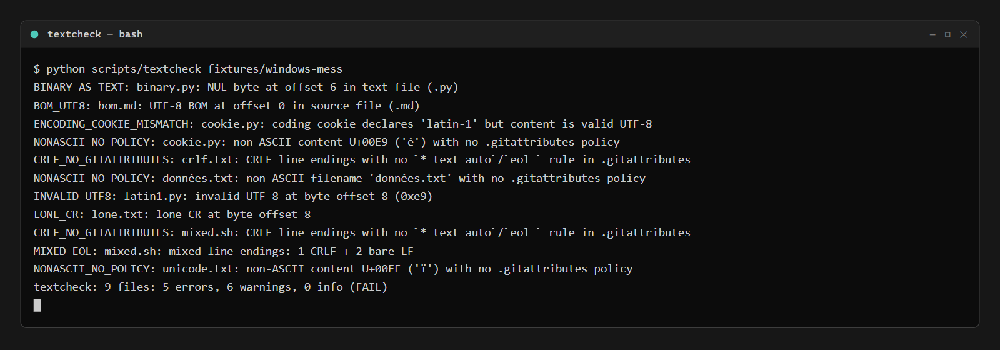
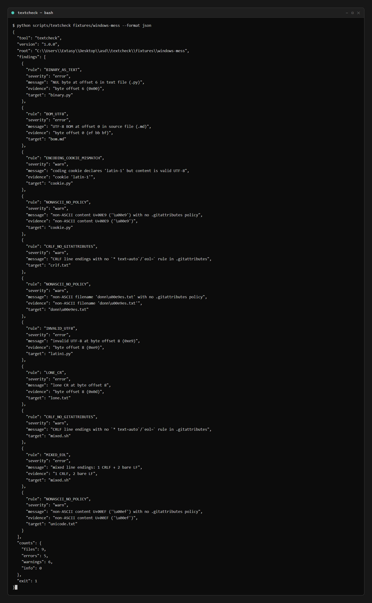

# textcheck

Repo text hygiene gate: invalid UTF-8, BOMs, mixed line endings, lone carriage returns, Python coding-cookie lies, NUL bytes in text files, CRLF without `.gitattributes` cover, and non-ASCII without policy — one verdict table, one JSON mirror. Single file, Python stdlib only.



## Why

Line endings and encodings are the oldest cross-platform landmine, and the official advice is a policy file most repos never gate:

- [GitHub's own docs](https://docs.github.com/en/get-started/getting-started-with-git/configuring-git-to-handle-line-endings) recommend every repo ship a `.gitattributes` with `* text=auto` — "to avoid problems in your diffs". Almost nobody verifies the tree actually complies.
- Real breakage, filed as bugs: ["[bug] CRLF line endings break parsing"](https://github.com/anton-efremov/shiny-diagram/issues/10), and repos created specifically to ["normalize line endings with .gitattributes"](https://github.com/marctjones/napkin/issues/3).

`textcheck` scans the bytes and tells you, with byte offsets.

## Quick start

```console
$ python scripts/textcheck fixtures/windows-mess
BINARY_AS_TEXT: binary.py: NUL byte at offset 6 in text file (.py)
BOM_UTF8: bom.md: UTF-8 BOM at offset 0 in source file (.md)
ENCODING_COOKIE_MISMATCH: cookie.py: coding cookie declares 'latin-1' but content is valid UTF-8
NONASCII_NO_POLICY: cookie.py: non-ASCII content U+00E9 ('é') with no .gitattributes policy
CRLF_NO_GITATTRIBUTES: crlf.txt: CRLF line endings with no `* text=auto`/`eol=` rule in .gitattributes
NONASCII_NO_POLICY: données.txt: non-ASCII filename 'données.txt' with no .gitattributes policy
INVALID_UTF8: latin1.py: invalid UTF-8 at byte offset 8 (0xe9)
LONE_CR: lone.txt: lone CR at byte offset 8
CRLF_NO_GITATTRIBUTES: mixed.sh: CRLF line endings with no `* text=auto`/`eol=` rule in .gitattributes
MIXED_EOL: mixed.sh: mixed line endings: 1 CRLF + 2 bare LF
NONASCII_NO_POLICY: unicode.txt: non-ASCII content U+00EF ('ï') with no .gitattributes policy
textcheck: 9 files: 5 errors, 6 warnings, 0 info (FAIL)
```

## JSON mirror

```console
$ python scripts/textcheck fixtures/windows-mess --format json
```



```json
{
  "tool": "textcheck",
  "version": "1.0.0",
  "exit": 1,
  "counts": {"files": 9, "errors": 5, "warnings": 6, "info": 0},
  "findings": [
    {"rule": "INVALID_UTF8", "severity": "error",
     "message": "invalid UTF-8 at byte offset 8 (0xe9)",
     "evidence": "byte offset 8 (0xe9)",
     "target": "latin1.py"}
  ]
}
```

## Rules

| rule | level | what it catches |
|---|---|---|
| `INVALID_UTF8` | error | bytes that are not valid UTF-8 in a text file (byte offset evidence) |
| `BOM_UTF8` | error (info for `.ps1`/`.txt` unless `--bom-policy strict`) | UTF-8 BOM at offset 0 |
| `MIXED_EOL` | error | CRLF mixed with bare LF in one file (counts of each) |
| `LONE_CR` | error | bare CR not followed by LF (byte offset evidence) |
| `ENCODING_COOKIE_MISMATCH` | warn | Python `coding:` cookie declares non-UTF-8 while bytes are valid UTF-8 |
| `BINARY_AS_TEXT` | error | NUL byte in a text-extension file (binaries skipped by design otherwise) |
| `CRLF_NO_GITATTRIBUTES` | warn | CRLF present but no `* text=auto`/`eol=` rule at the scanned root |
| `NONASCII_NO_POLICY` | warn | non-ASCII filename or content with no `.gitattributes` cover |
| `SCAN_ERROR` | error | file could not be read (environmental, never a content verdict) |

## Flags

| flag | effect |
|---|---|
| `path` | directory tree to scan (default: `.`) |
| `--bom-policy lenient\|strict` | lenient: BOM in `.ps1`/`.txt` is info; strict: every BOM is an error |
| `--exclude PATTERN` / `--exclude-file FILE` | repeatable `.gitignore`-style skips |
| `--format json` | full machine-readable report on stdout |

Exit codes: `0` clean (warnings/info allowed), `1` one or more errors, `2` usage error. Read-only: never rewrites files, never converts encodings, no network. `.git`, `node_modules`, `__pycache__`, venvs and build dirs are never descended into.

## Bench

```console
$ python bench/bench.py
```

```text
probe                                      expected         detected             median   thresh  verdict
----------------------------------------------------------------------------------------------------------------
scan windows-mess (9 files)                5 errors, 6 warns 5 errors, 6 warns      1.0       80  ok
scan synthetic corpus (2000 files, 5.6 MB) 0 errors         0 errors             482.2      700  ok
cli json subprocess (windows-mess)         exit 1           exit 1                65.4     1600  ok
bench: 16/16 probes correct
```

## What it never does

- never rewrites or converts anything (report-only; a BOM stays a BOM),
- never touches the network,
- never descends into `.git`/`node_modules`/`__pycache__`/venvs,
- never double-reports: a BOM is one finding, not two (the BOM char itself is excluded from the non-ASCII check),
- never guesses encodings: undecodable bytes in non-text extensions are skipped, in text files they are errors with offsets.

## Tests & CI

`python -m unittest discover -s tests` → 15 tests: every rule on byte-exact fixtures (real CRLF, real BOM, real lone-CR, real NUL), the BOM-dedup pin, lenient/strict policy, excludes, exit codes, JSON mirror. CI runs the suite, the published bench, and clean/mess/strict fixture gates on every push ([`.github/workflows/test.yml`](.github/workflows/test.yml)).

## License

MIT — see [LICENSE](LICENSE).
